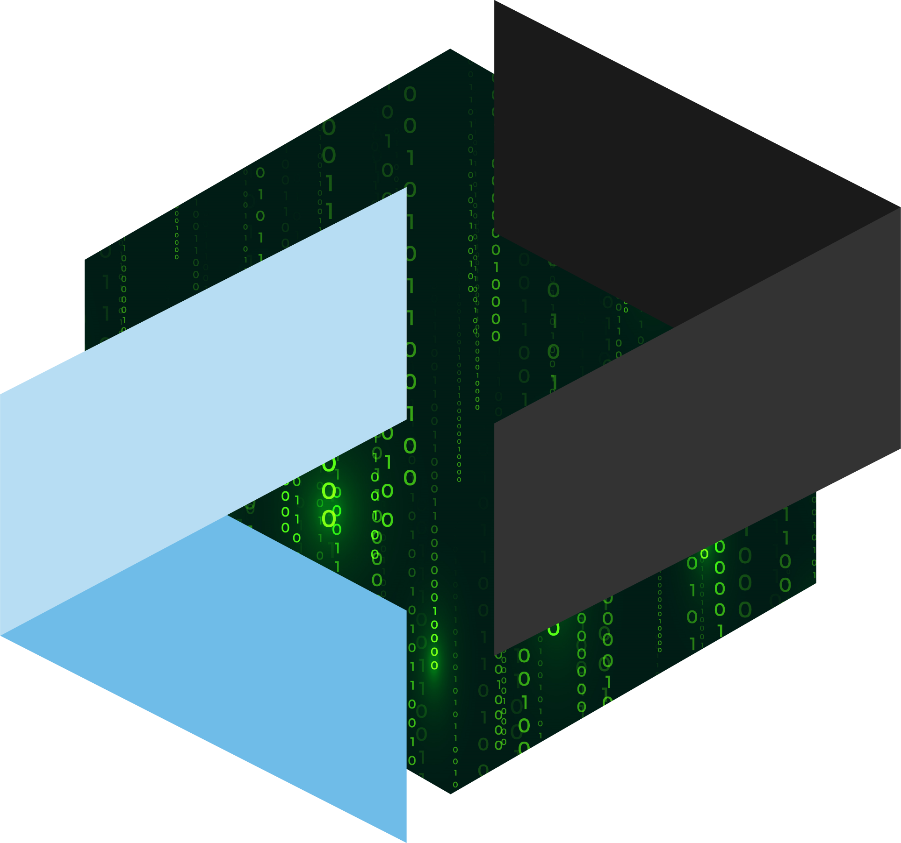

# `<Hello World, I'm RedBoardDev/>` <a href="https://discord.com/users/419926802366988292" target="_blank"></a> <a href="https://www.linkedin.com/in/thomas--ott/" target="_blank"></a><a href="https://thomasott.fr" target="_blank"></a>

```python
import github
readme = github.User(id=53050011).readme
readme.show()
```


<p align="center">
  
  <br/>
  <br/>
  
  
  
  
  
  
  
  
  
  <br/>
  
  
  
  
  
  
  
  
  
  
  
</p>
<br/>
<p align="center">
  <a href="https://git.io/streak-stats"></a>
</p>
<br/>
